# Enhanced EEG-Based ADHD Detection Using CNN-LSTM with Attention

## Project Overview

This project develops an automated deep-learning framework for distinguishing **ADHD subjects from control subjects using multichannel EEG signals**.

The proposed pipeline processes raw EEG, reduces artifacts and unwanted signal components, segments the signal into fixed temporal windows, learns spatial and temporal patterns using **CNN + LSTM**, uses **attention** to focus on informative time segments, and produces a subject-level ADHD/Control prediction.

## Workflow

```mermaid
flowchart LR
    A["19-Channel EEG Input"] --> B["Preprocessing"]
    B --> C["Segmentation"]
    C --> D["CNN\nSpatial Feature Extraction"]
    D --> E["LSTM\nTemporal Modeling"]
    E --> F["Attention\nImportant Time Segments"]
    F --> G["Fully Connected + Softmax"]
    G --> H["Window-Level Predictions"]
    H --> I["Subject-Level Aggregation"]
    I --> J["ADHD / Control"]
    J --> K["Evaluation + Explainability"]
```

### Main processing stages

1. **EEG Input** — Multichannel EEG recordings, using the required EEG channels (e.g., 19 channels).
2. **Preprocessing** — Channel selection and quality checking, artifact/noise reduction, band-pass filtering (1–50 Hz), and normalization.
3. **Segmentation** — Continuous EEG is divided into fixed temporal windows suitable for model input.
4. **CNN** — Learns spatial/channel-related EEG features.
5. **LSTM** — Learns temporal dependencies across the extracted feature sequence.
6. **Attention** — Gives greater importance to informative time segments.
7. **Classification** — Produces ADHD and Control probabilities.
8. **Post-processing** — Aggregates valid window predictions into a subject-level prediction and estimates confidence.
9. **Evaluation & Explainability** — Uses standard classification metrics and attention/channel importance to understand model behavior.

## Objectives

- Build an automated EEG-based system for ADHD vs Control classification.
- Preprocess raw 19-channel EEG to reduce artifacts, noise and unwanted components.
- Segment continuous EEG into consistent temporal windows.
- Learn spatial EEG patterns using CNN layers.
- Learn temporal dependencies using LSTM layers.
- Add an attention mechanism to emphasize informative temporal segments.
- Aggregate window predictions into a subject-level decision.
- Evaluate using accuracy, precision, recall/sensitivity, specificity, F1-score and confusion matrix.
- Provide explainability through channel and time-segment importance.

## Enhancements Over the Base Paper

| Enhancement | Contribution |
|---|---|
| **CNN + LSTM combination** | Combines spatial feature learning with temporal dependency modeling. |
| **Attention mechanism** | Highlights informative time segments instead of treating all segments equally. |
| **Enhanced preprocessing** | Includes channel selection, quality checking, artifact/noise reduction, filtering and normalization. |
| **Subject-level aggregation** | Combines multiple window predictions for a more stable subject-level decision. |
| **Confidence estimation** | Uses prediction probabilities and consistency to communicate prediction confidence. |
| **Explainability** | Provides insight into important EEG channels and temporal segments. |
| **Deployment-oriented design** | Designed to be extended into a full-stack application with EEG upload, inference and result visualization. |

## Project Summary

The system follows a complete pipeline from raw EEG to an interpretable subject-level prediction. Preprocessing improves signal quality, segmentation creates consistent learning samples, CNN extracts spatial patterns, LSTM captures temporal behavior, and attention focuses the model on the most informative portions of the EEG sequence. Window-level predictions are then aggregated to obtain the final ADHD/Control decision. Evaluation metrics and explainability outputs provide both performance assessment and insight into model decisions.

## Team Work Distribution

| Team Member | Primary Responsibility | Major Tasks |
|---|---|---|
| **Nithya** | EEG Data & Preprocessing | Dataset organization, EEG channel handling, signal-quality checks, artifact/noise reduction, filtering, normalization and preprocessing documentation. |
| **Veda Gayathri** | Model Development & Training | CNN architecture, spatial feature extraction, LSTM integration, attention layer, model training and hyperparameter tuning. |
| **Meghana** | Evaluation & Explainability | Accuracy, precision, recall, specificity, F1-score, confusion matrix, attention/channel/time visualizations and result analysis. |
| **Jacinth** | Backend & API | Model inference pipeline, backend services/API, EEG upload integration, trained-model serving and backend testing. |
| **Rusheel** | Frontend, Integration & Deployment | Web interface, EEG upload flow, prediction dashboard, backend integration, result visualization, explainability UI and final deployment. |

### Team workflow

**Nithya → Veda Gayathri → Meghana → Jacinth → Rusheel**

The work is connected rather than isolated: preprocessing feeds model development, model outputs feed evaluation, the trained model is exposed through the backend, and the frontend integrates the complete system for deployment.

---

**Team:** Nithya · Veda Gayathri · Meghana · Jacinth · Rusheel

## Quick Access

Scan the QR code below to open this project overview directly on GitHub.

[Open the project overview](https://github.com/Rusheel12/ADHD-LSTM-CNN/blob/main/PROJECT_OVERVIEW.md)
